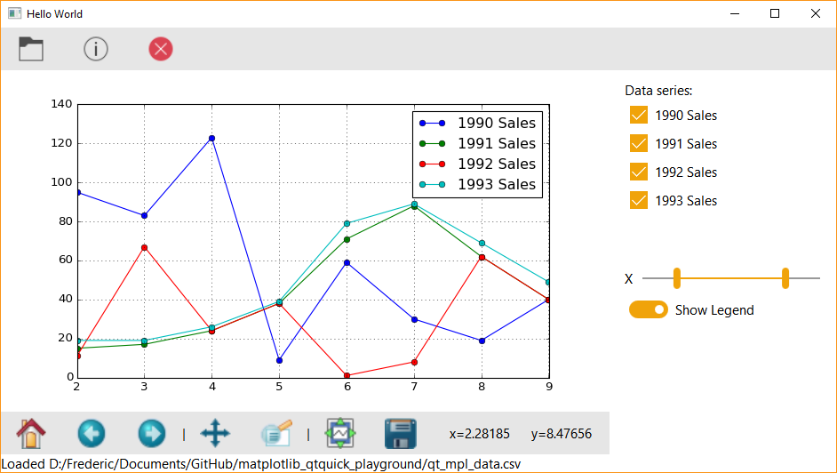

# matplotlib_qtquick_playground
Port of the example kindly provided by Eli Bendersky to PyQt5:
https://github.com/eliben/code-for-blog/tree/master/2009/pyqt_dataplot_demo

Derivation of the example have been made based on the three following Qt technologies:
- QtWidgets
- QtQuick Controls 1.0
- QtQuick Controls 2.0 (actually Qt.labs.controls 1.0 as I used PyQt 5.6)

The goal of this work was to play around with QtQuick and PyQt5. The integration of matplotlib with QtWidgets is the best
as a backend support full interactivity and navigation toolbar. A new matplotlib backend based on a QQuickItem has been
created to restore maximal interactivity.

The logic behind QtWidgets GUI and QtQuick is quite different. For example, in the former, the Python script takes care of
reading all widgets before updating the figure. But in the latter, QtQuick controls are binded to Python properties that 
emit signal forcing the figure to update.

## QtWidgets version

## QtQuick Controls 1.0 version

## QtQuick Controls 2.0 version

Code functions
==============

Series of data are loaded from a .csv file, and their names are
displayed in a checkable list view. The user can select the series
it wants from the list and plot them on a matplotlib canvas.
Use the sample .csv file that comes with the scripts for an example
of data series.

Requirements
============

* Python >= 3.5
* PyQt = 5.6 (if you plan to use PyQt 5.7, references have changed as QtQuick.Controls 2.0 have integrated the official library)
* matplolib >= 1.4

License
=======

MIT License

Copyright (C) 2016 Frederic Collonval

The code for QtQuick Controls 2.0 makes used of the KDE Breeze Icons Theme (https://github.com/KDE/breeze-icons) distributed under LGPLv3

> The Breeze Icon Theme in icons/

> Copyright (C) 2014 Uri Herrera and others
